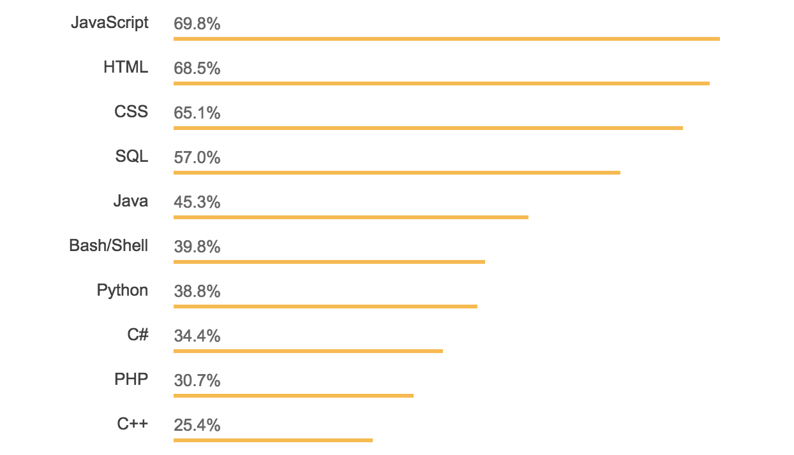

# The Reason for ReasonML
**Tianyu (Tian) Pu**
[@tianyupu](https://www.twitter.com/tianyupu)
---

---
```nohighlight
Cannot read property '____' of undefined
```
---

---

---


---

---

---
## 🚀 A whirlwind tour of ReasonML 🚀
---
…
…
…
…

---

Basics
…
…
…

---

Basics
Data structures
…
…

---

Basics
Data structures
Pattern matching
…

---

Basics
Data structures
Pattern matching
Extras

---

➡️ Basics
Data structures
Pattern matching
Extras

---
### (Im)mutability

```reasonml
let meaningOfLife = 42;
let meaningOfLife = 9001;
```

```reasonml
let meaningOfLife = ref(42);
meaningOfLife := 9001;
```

---
### Types

100% coverage

Sound

Inferred
---
### Types in action

```reasonml
type name = string;
```

```reasonml
let firstName: name = "Tian";
```

---
➡️ Basics
Data structures
Pattern matching
Extras

---

✅ Basics
➡️ Data structures
Pattern matching
Extras

---
### Tuples

```reasonml
(1, "H", 1.008)
(2, "He", 4.0026)
```

---
### Records

```reasonml
type conference = {
  …
  …
  …
};
```

---

### Records

```reasonml
type conference = {
  name: string,
  year: int,
  location: string
};
```

---
### Records

```reasonml
let thisConference = {
  … 
  … 
  … 
};
```

---

### Records

```reasonml
let thisConference = {
  name: "FrontConf",
  year: 2019,
  location: "Munich"
};
```

---
### Objects - closed

```reasonml
type person = {
  …
  …
};
```

---

### Objects - closed

```reasonml
type person = {
  …
  name: string
};
```

---

### Objects - closed

```reasonml
type person = {
  .
  name: string
};
```

---

### Objects - closed

```reasonml
let author: person = {
  …
  …
};
```

```reasonml
…
```

---

### Objects - closed 

```reasonml
let author: person = {
  val age = 100;
  …
};
```

```reasonml
…
```

---

### Objects - closed 

```reasonml
let author: person = {
  val age = 100;
  pub name = "V. Hugo";
};
```

```reasonml
…
```

---

### Objects - closed 

```reasonml
let author: person = {
  val age = 100;
  pub name = "V. Hugo";
};
```

```reasonml
author#name
```

---
### Objects - open

```reasonml
type named('t) = {
  ..
  name: string
} as 't;
```

---
### Objects - open

```reasonml
let author: named({
  …
  …
  …
}) = {
  …
  …
  …
  …
};
```

---

### Objects - open

```reasonml
let author: named({
  .
  name: string,
  …
}) = {
  …
  …
  …
  …
};
```

---

### Objects - open

```reasonml
let author: named({
  .
  name: string,
  write: string => unit
}) = {
  …
  …
  …
  …
};
```

---

### Objects - open

```reasonml
let author: named({
  .
  name: string,
  write: string => unit
}) = {
  …
  pub name = "V. Hugo";
  …
  …
};
```

---

### Objects - open

```reasonml
let author: named({
  .
  name: string,
  write: string => unit
}) = {
  val currentBook = ref("");
  pub name = "V. Hugo";
  …
  …
};
```

---

### Objects - open

```reasonml
let author: named({
  .
  name: string,
  write: string => unit
}) = {
  val currentBook = ref("");
  pub name = "V. Hugo";
  pub write = string => 
    …
};
```

---

### Objects - open

```reasonml
let author: named({
  .
  name: string,
  write: string => unit
}) = {
  val currentBook = ref("");
  pub name = "V. Hugo";
  pub write = string => 
    currentBook := currentBook^ ++ string
};
```

---
```reasonml
let print_name: named('t) => unit = 
  …
```

---

```reasonml
let print_name: named('t) => unit = 
  n => print_endline(n#name);
```

---
✅ Basics
➡️ Data structures
Pattern matching
Extras

---

✅ Basics
✅️ Data structures
➡️ Pattern matching
Extras

---
### Variants

```reasonml
type loginStatus = 
  | NotLoggedIn
  | LoggedIn(string)
```

---
### Pattern matching (1)

```reasonml
let status = LoggedIn("tian");
…
…
…
…
…
```

---

### Pattern matching (1)

```reasonml
let status = LoggedIn("tian");
switch (status) {
  …
  …
  …
}
```

---

### Pattern matching (1)

```reasonml
let status = LoggedIn("tian");
switch (status) {
  | NotLoggedIn => ":("
  | …
  | …
}
```

---

### Pattern matching (1)

```reasonml
let status = LoggedIn("tian");
switch (status) {
  | NotLoggedIn => ":("
  | LoggedIn("admin") => "!"
  | …
}
```

---

### Pattern matching (1)

```reasonml
let status = LoggedIn("tian");
switch (status) {
  | NotLoggedIn => ":("
  | LoggedIn("admin") => "!"
  | LoggedIn(user) => ":)"
}
```

---
### Pattern matching (2)

```reasonml
switch (someList) {
  …
  …
  …
}
```

---

### Pattern matching (2)

```reasonml
switch (someList) {
  | [] => "The list is empty..."
  …
  …
}
```

---

### Pattern matching (2)

```reasonml
switch (someList) {
  | [] => "The list is empty..."
  | [head, ...tail] => …
  …
}
```

---

### Pattern matching (2)

```reasonml
switch (someList) {
  | [] => "The list is empty..."
  | [head, ...tail] => head ++
    " is the first item"
}
```

---
### Pattern matching (3)

```reasonml
switch (divisibleBy3, divisibleBy5) {
  …
  …
  …
  …
}
```

---

### Pattern matching (3)

```reasonml
switch (divisibleBy3, divisibleBy5) {
  | (true, true)    => …
  | (true, false)   => …
  | (false, true)   => …
  | (false, false)  => …
}
```

---

### Pattern matching (3)

```reasonml
switch (divisibleBy3, divisibleBy5) {
  | (true, true)    => "Fizz Buzz"
  | (true, false)   => "Fizz"
  | (false, true)   => "Buzz"
  | (false, false)  => ""
}
```

---
### Special mention

```reasonml
type option('t) = 
  | Some('t)
  | None
```

---
No more null / undefined bugs, ever! 🙌
---
✅ Basics
✅ Data structures
➡️ Pattern matching
Extras

---

✅ Basics
✅️ Data structures
✅ Pattern matching
➡️ Extras

---
### Modules

Every .re file is a module

No need to import modules
---
Directory structure changes? Easy!
---
### `external`

```reasonml
external cStrcmp: string => string => int = "strcmp";
```

---
✅ Basics
✅️ Data structures
✅ Pattern matching
➡️ Extras

---

✅ Basics
✅️ Data structures
✅ Pattern matching
✅ Extras

---
### _Reason #1:_

The language! ✨
---
## But, JavaScript?!?!

---
…
…
…

---
Reason & JS
…
…

---

Reason & JS
JS in Reason
…

---

Reason & JS
JS in Reason
Reason in JS

---

➡️ Reason & JS
JS in Reason
Reason in JS

---
ReasonML != JavaScript
---
ReasonML == OCaml
---
OCaml → native code
---
OCaml → JavaScript!
---
How? 🤔
---

---
### BuckleScript

1 Reason file → 1 JS file

Use the JS files as normal
---
All you need: **bsconfig.json** and **`bsb`**
---
#### Minimal bsconfig.json

```json
{
  "name": "my-project",
  "sources": {
    "dir": "src"
  }
}
```

---
#### `bsb`

```nohighlight
npm install -g bs-platform
```

```nohighlight
bsb -make-world [-w]
```

---
```reasonml
EventTargetRe.addKeyDownEventListener(
  …
  …
);
```

---

```reasonml
EventTargetRe.addKeyDownEventListener(
  …
  DocumentRe.asEventTarget(Webapi.Dom.document)
);
```

---

```reasonml
EventTargetRe.addKeyDownEventListener(
  self.state.keyDownHandler^,
  DocumentRe.asEventTarget(Webapi.Dom.document)
);
```

---
```reasonml
EventTargetRe.addKeyDownEventListener(
  self.state.keyDownHandler^,
  DocumentRe.asEventTarget(Webapi.Dom.document)
);
```

```javascript
document.addEventListener("keydown",
  self[/* state */1][/* keyDownHandler */2][0]);
```

---
TLDR; You can already write entire JS apps in pure Reason! 🎉
---
➡️ Reason & JS
JS in Reason
Reason in JS

---

✅ Reason & JS
➡️ JS in Reason
Reason in JS

---
Remember `external`?
---
```reasonml
external cStrcmp: string => string => int = "strcmp";
```

```reasonml
[@bs.val] btoa: string => string = "btoa";
```

```reasonml
let encodedData = btoa("Hi, FrontConf!");
```

---
But first, check for existing bindings!
---

---
Add it to `bs-dependencies` in bsconfig.json:

```json
{
  "name": "my-project",
  "sources": {
    "dir": "src"
  },
  "bs-dependencies": [
    "bs-webapi"
  ]
}
```

---
**Don't forget package.json!**
---
✅ Reason & JS
➡️ JS in Reason
Reason in JS

---

✅ Reason & JS
✅ JS in Reason
➡️ Reason in JS

---
Again, the bsconfig.json:

```json
{
  "name": "my-project",
  "sources": { "dir": "src" },
  "bs-dependencies": [ "bs-webapi" ],
  …
  …
  …
  …
  …
}
```

---

Again, the bsconfig.json:

```json
{
  "name": "my-project",
  "sources": { "dir": "src" },
  "bs-dependencies": [ "bs-webapi" ],
  "package-specs": [{
    "module": "commonjs",
    …
  }],
  …
}
```

---

Again, the bsconfig.json:

```json
{
  "name": "my-project",
  "sources": { "dir": "src" },
  "bs-dependencies": [ "bs-webapi" ],
  "package-specs": [{
    "module": "commonjs",
    "in-source": true
  }],
  …
}
```

---

Again, the bsconfig.json:

```json
{
  "name": "my-project",
  "sources": { "dir": "src" },
  "bs-dependencies": [ "bs-webapi" ],
  "package-specs": [{
    "module": "commonjs",
    "in-source": true
  }],
  "suffix": ".bs.js"
}
```

---
#### Supported module types

```nohighlight
amdjs[-global]
commonjs
es6[-global]
```

---
✅ Reason & JS
✅ JS in Reason
➡️ Reason in JS

---

✅ Reason & JS
✅ JS in Reason
✅ Reason in JS

---
### _Reason #2:_

Smooth JS interop 👌
---
## Questions?

---
## Recap

---
## The end

---
## The ~~end~~ beginning

---
## Thank you!
[@tianyupu](https://www.twitter.com/tianyupu)
[reason-slides.surge.sh](http://reason-slides.surge.sh/)
---
## Some great resources
[Getting started with ReasonML](http://2ality.com/2017/11/getting-started-reasonml.html)
[OCaml for the skeptical](https://www2.lib.uchicago.edu/keith/ocaml-class/home.html)
[BuckleScript user manual](https://bucklescript.github.io/bucklescript/Manual.html)
[BuckleScript directives reference](https://github.com/moroshko/bs-blabla)
[bsconfig schema reference](https://bucklescript.github.io/bucklescript/docson/#build-schema.json)
---
## Credits
[This is fine](https://www.theverge.com/2016/5/5/11592622/this-is-fine-meme-comic)
[ES6 logo](https://github.com/topics/es6)
[Flow logo](https://flow.org/)
[TypeScript logo](https://www.typescriptlang.org/)
[Reason logo](https://reasonml.github.io/en/)
[OCaml logo](https://ocaml.org/)
[StackOverflow Developer Survey](https://insights.stackoverflow.com/survey/2018/#technology)