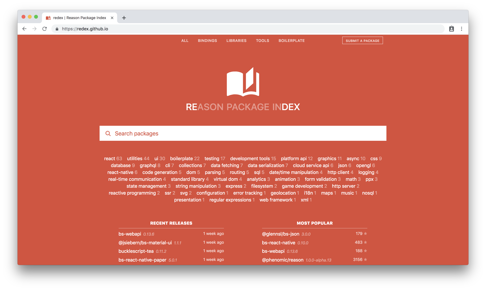

# The Reason for ReasonML
### Tianyu Pu


---

---
```
Cannot read property '____' of undefined
```
---

---
(logos of various libraries designed to make JS less hard)
---

---

---
## A whirlwind tour of ReasonML
---
### Types (1)

100% coverage

Sound

Inferred
---
### Types (2)

```
type name = string;
```

---
### Variants

```
type loginStatus = 
  | NotLoggedIn
  | LoggedIn(string)
```

---
### Pattern matching (1)

```
let status = LoggedIn("tian");
switch (status) {
    | NotLoggedIn => "Please login"
    | LoggedIn("admin") => "Welcome, superuser!"
    | LoggedIn(username) => "Hello, " ++ username
}
```

---
### Pattern matching (2)

```
switch (list) => {
    | [] => "The list is empty..."
    | [head, ...tail] => "The first item is " ++ a
}
```

---
### Pattern matching (3)

(pattern matching of a complex if-else)

---
### Special mention: `option`

```
type option('t) = 
  | Some('t)
  | None
```

---
No more null / undefined bugs, ever! 🙌
---
### Tuples

```
(1, "H", 1.008)
(2, "He", 4.0026)
```

---
### Records (1)

```
type conference = {
  name: string,
  year: int,
  location: string
};
```
---
### Records (2)

```
let thisConference = {
  name: "Codemotion",
  year: 2019,
  location: "Amsterdam"
};
```

---
### Objects - closed (1)

```
type person = {
    .
    name: string
};
```

---
### Objects - closed (2)

```
let author: person = {
    val authorName = "Victor Hugo";
    pub name = authorName;
};
```

```
author#name
```

---
### Objects - open (1)

```
type named('t) = {
    ..
    name: string
} as 't;
```

---
### Objects - open (2)

```
let author: named({. name: string, write: string => unit}) = {
    val currentBook = ref(string);
    pub name = "Victor Hugo";
    pub write = string => currentBook := currentBook^ ++ string
};
```

---
### Immutability (1)

```
let meaningOfLife = 42;
let meaningOfLife = 9001;
```

---
### Immutability (2)

```
let meaningOfLife = ref(42);
meaningOfLife := 9001;
```

---
### Modules

Every .re file is a module

No need to import modules
---
Directory structure changes? Easy!
---
### `external`

```
external cStrcmp: string => int = "strcmp";
```

---
### _Reason #1:_

The language!
---
## But, JavaScript?!?!

---
ReasonML != JavaScript
---
ReasonML == OCaml
---
OCaml → native code
---
OCaml → JavaScript!
---
How? 🤔
---

---
### BuckleScript

1 Reason file → 1 JS file

Use the JS files as normal
---
All you need: **bsconfig.json** and **`bsb`**
---
#### Minimal bsconfig.json

```
{
  "name": "my-project",
  "sources": {
    "dir": "src"
  },
}
```

---
#### `bsb`

```
npm install -g bs-platform
```

```
bsb -make-world [-w]
```

---
(example of compiled JS)
---
TLDR; You can already write entire JS apps in pure Reason! 🎉
---
### Using JS libraries in Reason
---
Remember `external`?
---

```
external cStrcmp: string => int = "strcmp";
```

```
[@bs.val] btoa: string => string = "btoa";
```

```
let encodedData = btoa("Hi, Codemotion!");
```

---
But first, check for existing bindings!
---

---
Add it to `bs-dependencies` in bsconfig.json:

```
{
  "name": "my-project",
  "sources": {
    "dir": "src"
  },
  "bs-dependencies": [
    "bs-webapi"
  ]
}
```

---
Otherwise, write your own:
(examples)
---
### Using Reason in JS
---
Again, the bsconfig.json:

```
{
  "name": "my-project",
  "sources": { "dir": "src" },
  "bs-dependencies": [ "bs-webapi" ],
  "package-specs": [{
    "module": "commonjs",
    "in-source": true
  }],
  "suffix": ".bs.js"
}
```

---
(supported module types and examples of how to use)
---
(Migrating an existing file into Reason - the process)
---
### _Reason #2:_

Smooth JS interop, thanks to BuckleScript!
---
## Questions?

---
## The end

---
## The ~~end~~ beginning

---
## Thank you!
[linkedin.com/in/tianyupu](https://www.linkedin.com/in/tianyupu/)
---
## Resources
https://github.com/moroshko/bs-blabla